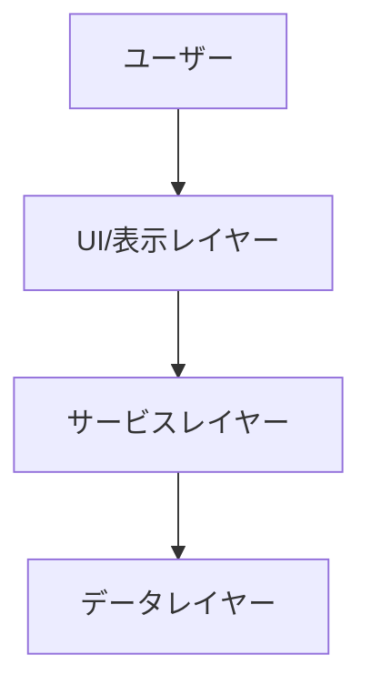
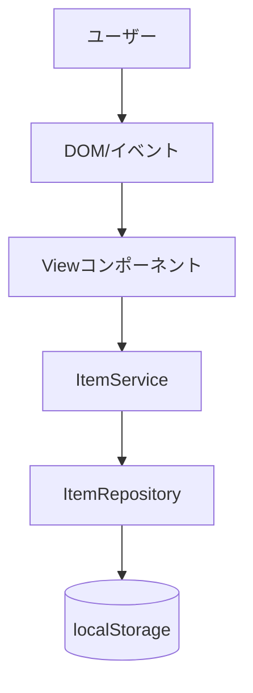
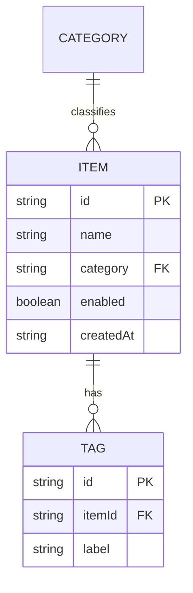
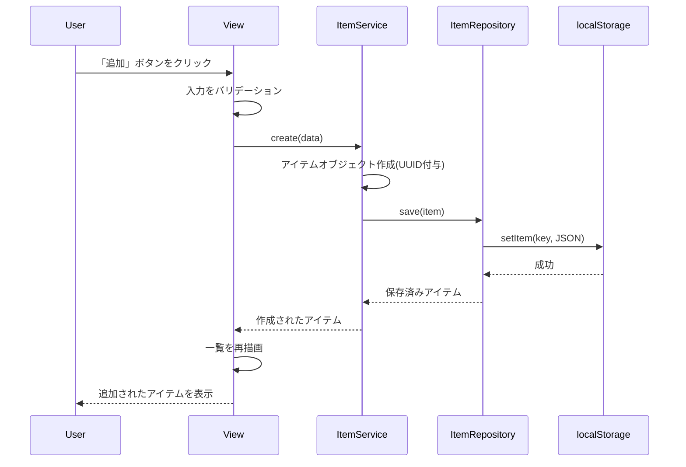

# 機能設計書作成ガイド

このガイドは、プロダクト要求定義書(PRD)に基づいて機能設計書を作成するための実践的な指針を提供します。

## 機能設計書の目的

機能設計書は、PRDで定義された「何を作るか」を「どう実現するか」に落とし込むドキュメントです。

**主な内容**:
- システム構成図
- データモデル
- コンポーネント設計
- アルゴリズム設計（該当する場合）
- UI設計
- エラーハンドリング

## 作成の基本フロー

### ステップ1: PRDの確認

機能設計書を作成する前に、必ずPRDを確認します。

```
Claude CodeにPRDから機能設計書を作成してもらう際のプロンプト例:

PRDの内容に基づいて機能設計書を作成してください。
特に優先度P0(MVP)の機能に焦点を当ててください。
```

### ステップ2: システム構成図の作成

#### Mermaid記法の使用

システム構成図はMermaid記法で記述します。

**基本的な3層アーキテクチャの例**（ブラウザSPA）:


**より詳細な例**（ブラウザSPA）:


### ステップ3: データモデル定義

#### TypeScript型定義で明確に

データモデルはTypeScriptのインターフェースで定義します。

**基本的なItem型の例**（ブラウザSPA）:
```typescript
interface Item {
  id: string;                    // UUID v4 (crypto.randomUUID())
  name: string;                  // 1-200文字
  category: Category;            // 分類(カテゴリ)
  enabled: boolean;              // 有効/無効フラグ
  createdAt: string;             // 作成日時 (ISO 8601文字列; localStorageはJSONなのでstring推奨)
  updatedAt: string;             // 更新日時 (ISO 8601文字列)
}

type Category = 'a' | 'b' | 'c';  // 実際のドメインに合わせて定義する
```

**重要なポイント**:
- 各フィールドにコメントで説明を追加
- 制約（文字数、形式など）を明記
- オプションフィールドには`?`を付ける
- 型エイリアスで可読性を向上
- **localStorageはJSON文字列で保存する**ため、`Date`型ではなくISO 8601の`string`で持つと復元が安全

#### ER図の作成

複数のエンティティがある場合、ER図で関連を示します。



### ステップ4: コンポーネント設計

各レイヤーの責務を明確にします。

#### UI（表示）レイヤー

**責務**: DOMの描画、ユーザー操作の受付、結果の表示

```typescript
// Viewコンポーネント
class ItemListView {
  // 一覧を描画する
  render(items: Item[]): void;

  // ユーザー操作(クリック等)をハンドリングする
  bindEvents(): void;

  // エラーを表示する
  displayError(error: Error): void;
}
```

#### サービスレイヤー

**責務**: ビジネスロジックの実装（UI・ストレージに依存しない）

```typescript
// ItemService
class ItemService {
  // アイテムを作成する
  create(data: CreateItemData): Item;

  // 一覧を取得する
  list(filter?: FilterOptions): Item[];

  // アイテムを更新する
  update(id: string, data: UpdateItemData): Item;

  // アイテムを削除する
  delete(id: string): void;
}
```

#### データレイヤー

**責務**: データの永続化と取得（localStorage）

```typescript
// ItemRepository
class ItemRepository {
  // 全件保存する
  saveAll(items: Item[]): void;

  // 全件読み込む
  loadAll(): Item[];

  // データが存在するか確認する
  exists(): boolean;
}
```

### ステップ5: アルゴリズム設計（該当する場合）

複雑なロジック（例: アニメーションの減速制御）は詳細に設計します。

#### 減速アニメーション(ease-out)の例

**目的**: 回転やスクロールなどのアニメーションを、最後になめらかに減速させて停止させる

**計算ロジック**:

##### ステップ1: 進行度(0→1)の算出

```
- アニメーション開始からの経過時間を、総再生時間で割って 0〜1 に正規化する
- t = 経過時間 / 総時間 (0 = 開始, 1 = 終了)
```

**計算式**:
```typescript
function progress(elapsedMs: number, durationMs: number): number {
  // 0〜1 にクランプ(範囲外に出さない)
  return Math.min(Math.max(elapsedMs / durationMs, 0), 1);
}
```

##### ステップ2: イージング関数の適用(ease-out)

```
- 線形(t)のままだと等速で味気ない
- ease-out は終盤をゆっくりにして「すーっと止まる」感触を出す
- 代表例: easeOutCubic = 1 - (1 - t)^3
```

**計算式**:
```typescript
function easeOutCubic(t: number): number {
  return 1 - Math.pow(1 - t, 3);
}
```

##### ステップ3: 現在値の算出

```
- 開始値 from と終了値 to の間を、イージング済みの進行度で補間する
- value = from + (to - from) * eased
```

**計算式**:
```typescript
function lerp(from: number, to: number, eased: number): number {
  return from + (to - from) * eased;
}
```

##### ステップ4: フレームループへの組み込み

**方針**: `requestAnimationFrame` で毎フレーム上記を計算し、`t >= 1` で停止する。

**完全な実装例**:
```typescript
class SpinAnimation {
  // from(開始角度)から to(停止角度)まで durationMs かけて減速停止する
  start(from: number, to: number, durationMs: number, onUpdate: (v: number) => void): void {
    const startTime = performance.now();

    const tick = (now: number) => {
      const t = Math.min((now - startTime) / durationMs, 1);
      const eased = this.easeOutCubic(t);
      onUpdate(from + (to - from) * eased);

      if (t < 1) {
        requestAnimationFrame(tick);  // 継続
      }
      // t >= 1 で自然に停止
    };

    requestAnimationFrame(tick);
  }

  private easeOutCubic(t: number): number {
    return 1 - Math.pow(1 - t, 3);
  }
}
```

### ステップ6: ユースケース図

主要なユースケースをシーケンス図で表現します。

**アイテム追加のフロー**（ブラウザSPA）:


### ステップ7: UI設計（該当する場合）

ブラウザSPAの場合、画面レイアウトとコンポーネント、状態ごとの見た目(CSS)を定義します。

#### 画面レイアウト(ワイヤーフレーム)

```
┌─────────────────────────────────────────┐
│  ヘッダー / タイトル                         │
├─────────────────────────────────────────┤
│  [ 追加フォーム: 名前入力 + カテゴリ選択 ]      │
├─────────────────────────────────────────┤
│  一覧                                      │
│  ☑ アイテムA   [編集] [削除]                 │
│  ☑ アイテムB   [編集] [削除]                 │
│  ☐ アイテムC   [編集] [削除]                 │
└─────────────────────────────────────────┘
```

#### 状態の表現(CSSクラス)

UIの状態は「CSSクラスの付け外し」で表現し、JS側はクラス名の制御に集中します。

**状態ごとのスタイル例**:
- 有効(enabled): 通常表示
- 無効(disabled): グレーアウト(`.is-disabled`)
- 選択/ハイライト中: 強調表示(`.is-active`)
- ローディング中: スピナー表示(`.is-loading`)

```typescript
// 例: 状態に応じてクラスを付け外しする
element.classList.toggle('is-disabled', !item.enabled);
```

### ステップ8: ファイル構造（該当する場合）

データの保存形式を定義します。

**例: ブラウザSPAのデータ保存(localStorage)**:
```
localStorage のキー設計:
  app:items     # アイテムデータ(JSON文字列)
  app:settings  # 設定データ(JSON文字列)
```

**`app:items` に保存するJSONの例**:
```json
{
  "version": 1,
  "items": [
    {
      "id": "7a5c6ff0-5f55-474e-baf7-ea13624d73a4",
      "name": "アイテムA",
      "category": "a",
      "enabled": true,
      "createdAt": "2026-06-08T10:00:00.000Z",
      "updatedAt": "2026-06-08T10:00:00.000Z"
    }
  ]
}
```

**ポイント**:
- `version` を持たせ、スキーマ変更時のマイグレーションに備える
- localStorageの値は文字列なので、`JSON.stringify` / `JSON.parse` で出し入れする
- 読み込み時は壊れたJSONや`null`に備えて`try/catch`し、失敗時は初期値で継続する

### ステップ9: エラーハンドリング

エラーの種類と処理方法を定義します。

| エラー種別 | 処理 | ユーザーへの表示 |
|-----------|------|-----------------|
| 入力検証エラー | 処理を中断、エラーメッセージ表示 | "名前は1-200文字で入力してください" |
| localStorage読み込みエラー(JSON破損等) | 空の初期データで継続 | "保存データを読み込めませんでした。初期化します" |
| 対象アイテムが見つからない | 処理を中断、エラーメッセージ表示 | "アイテムが見つかりません (ID: xxx)" |
| localStorage書き込み失敗(容量超過等) | 処理を中断、リトライを促す | "保存に失敗しました。不要なデータを削除してください" |

## 機能設計書のレビュー

### レビュー観点

Claude Codeにレビューを依頼します:

```
この機能設計書を評価してください。以下の観点で確認してください:

1. PRDの要件を満たしているか
2. データモデルは具体的か
3. コンポーネントの責務は明確か
4. アルゴリズムは実装可能なレベルまで詳細化されているか
5. エラーハンドリングは網羅されているか
```

### 改善の実施

Claude Codeの指摘に基づいて改善します。

## まとめ

機能設計書作成の成功のポイント:

1. **PRDとの整合性**: PRDで定義された要件を正確に反映
2. **Mermaid記法の活用**: 図表で視覚的に表現
3. **TypeScript型定義**: データモデルを明確に
4. **詳細なアルゴリズム設計**: 複雑なロジックは具体的に
5. **レイヤー分離**: 各コンポーネントの責務を明確に
6. **実装可能なレベル**: 開発者が迷わず実装できる詳細度