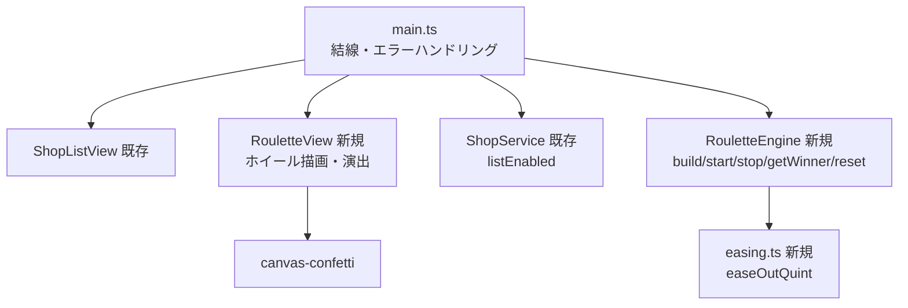

# 設計書

## アーキテクチャ概要

既存のレイヤードアーキテクチャを踏襲する。新規に **Engine層**（`src/engine/`）と **RouletteView**（`src/views/`）を追加し、`main.ts` で結線する。依存方向は常に UI → Service/Engine → Data。



> **結線方針**: `RouletteView` は `Engine` を直接保持せず、`main.ts` がハンドラ（onStart/onStop/onReset）経由で仲介する。既存の `ShopListView` ↔ `ShopService` と同じ「View はハンドラで上位へ委ねる」パターンに揃える。

## コンポーネント設計

### 1. src/types/Roulette.ts（新規）

**責務**: Engine と View の両レイヤーから参照されるルーレット固有型の定義。

```typescript
interface WheelSegment {
  shop: Shop;
  startAngle: number; // 度
  endAngle: number;   // 度（最終区画は厳密に360）
  color: string;      // 隣接（円環の先頭・末尾含む）で被らない塗り色
}
type RouletteState = 'idle' | 'spinning' | 'decelerating' | 'finished';
type AngleListener = (angleDeg: number) => void;
```

> `repository-structure.md` の方針どおり、複数レイヤー（engine / views / main）から参照するため `src/types/Roulette.ts` へ切り出す。

### 2. src/engine/easing.ts（新規）

**責務**: イージング関数。`easeOutQuint(t) = 1 - (1-t)^5`（終盤が粘る＝リーチ感）。

**実装の要点**: 純粋関数として独立させ、単体テスト（f(0)=0 / f(1)=1 / 単調増加）を容易にする。

### 3. src/engine/RouletteEngine.ts（新規）

**責務**: ホイール区画の構築（Fisher-Yatesシャッフル・色割当）、等速回転、減速＋着地、当選判定。DOMに依存しない純粋計算（`requestAnimationFrame` / `performance.now` のみ利用）。

**インターフェース**（functional-design.md準拠）:
```typescript
class RouletteEngine {
  get state(): RouletteState;                 // main がアイドル判定（ホイール再構築可否）に使う
  build(enabledShops: Shop[]): WheelSegment[]; // シャッフル＋区画割当＋色割当
  start(onUpdate: AngleListener): void;        // idle→spinning（等速 0.36deg/ms）
  stop(onUpdate: AngleListener, onFinish: (winner: Shop) => void): void; // spinning→decelerating→finished
  getWinner(finalAngleDeg: number): Shop;      // 針（12時）位置から当選を逆算
  reset(): void;                               // cancelAnimationFrame して idle へ
}
```

**実装の要点**:
- 停止角度を先に乱数で決め、そこから当選を逆算する（演出と抽選の分離・完全ランダム）
- `getWinner` の角度正規化は二重mod: `(((360 - a % 360) % 360) + 360) % 360`
- 最終区画の `endAngle` は厳密に `360` に固定（浮動小数点誤差の隙間防止）
- 色パレットは4色以上を循環割当し、末尾が先頭と同色なら次の色へずらす
- 減速は `easeOutQuint`、余分回転4〜6周＋ランダム着地、所要4000〜6000ms
- `state` / `currentAngle` / `rafId` は内部保持。`stop()` は `spinning` 時のみ、`start()` は `idle` 時のみ有効（状態ガード）
- テスト容易性のため、乱数・RAFはvitestの `vi.stubGlobal` / fakeTimersでモック可能な標準APIのみ使用

### 4. src/views/RouletteView.ts（新規）

**責務**: ホイールのcanvas描画、CSS transformによる回転反映、Start/Stop/もう一度ボタンの制御、当選演出（点滅・ズーム・店名表示・紙吹雪）。ロジックは持たない。

**インターフェース**:
```typescript
interface RouletteHandlers {
  onStart: () => void;
  onStop: () => void;
  onReset: () => void; // 「もう一度」
}

class RouletteView {
  constructor(root: HTMLElement);
  bindEvents(handlers: RouletteHandlers): void;
  renderWheel(segments: WheelSegment[]): void;   // canvasへ扇形＋絵文字＋店名を描画
  setAngle(angleDeg: number): void;              // transform: rotate() で回転反映
  setPhase(state: RouletteState): void;          // ボタンのenabled/disabledをまとめて制御
  playWinnerEffect(winner: Shop): void;          // オーバーレイ＋点滅＋ズーム＋confetti
  hideWinner(): void;                            // リセット時にオーバーレイを閉じる
  setControlsEnabled(canStart: boolean): void;   // 対象0件時はStart不可＋案内メッセージ
}
```

**実装の要点**:
- 扇形は `<canvas>` に `arc` で描画し、回転は **canvas要素へのCSS `transform: rotate()`**（毎フレーム再描画しない・GPU合成）
- 店名・絵文字は各区画の中央角度に沿って `fillText` で配置（長い店名は省略記号で切り詰め）
- canvasの `getContext('2d')` が `null` の環境（jsdom）では描画をスキップして落ちない（jsdomでの振る舞いテストを可能にするため）
- 店名表示はcanvasの `fillText` とオーバーレイの `textContent` のみ（XSS安全）
- 当選オーバーレイ: `.is-blinking` / `.is-zoomed` のCSSクラスでアニメーション
- 紙吹雪は `canvas-confetti` のデフォルトAPIを当選時に1回発火

### 5. main.ts（変更）

**責務**: `#app` 内に2カラムレイアウトのコンテナ（`.app-layout` > お店管理 / ルーレット）を生成し、各Viewへ注入。ルーレット操作のハンドラを結線。

**結線フロー**:
- `onStart`: `service.listEnabled()` → `engine.build()` → `view.renderWheel()` → `engine.start(view.setAngle)`
- `onStop`: `engine.stop(view.setAngle, (winner) => view.playWinnerEffect(winner))`
- `onReset`: `engine.reset()` → `view.hideWinner()` → ホイール再構築
- お店のCRUD成功時（既存ハンドラ）: `engine.state === 'idle'` のときのみ `engine.build()` でホイールを再構築し、`setControlsEnabled(対象>=1)` を更新

> **回転中のお店変更**: 回転中（spinning/decelerating）はホイールを再構築しない（当選判定はEngine内のセグメントスナップショットで完結するため安全）。停止後のリセットで最新データが反映される。

## データフロー

### UC-2: ルーレットを回して当選を決める
```
1. [Start] → main: listEnabled() で対象店取得（0件ならStart不可のためここには来ない）
2. main: engine.build(対象店) → view.renderWheel(segments)
3. main: engine.start(view.setAngle) — RAFで毎フレーム角度更新
4. [Stop] → main: engine.stop(view.setAngle, onFinish)
5. engine: easeOutQuintで減速 → 着地 → onFinish(winner)
6. view: playWinnerEffect(winner) — 点滅＋ズーム＋店名＋confetti
7. [もう一度] → main: engine.reset() → view.hideWinner() → ホイール再構築
```

## エラーハンドリング戦略

- 既存の `ValidationError` / `NotFoundError` / `StorageError` で十分。新規エラークラスは追加しない
- 対象0件は「エラー」ではなくUI状態（Startボタンdisabled＋案内メッセージ「ルーレット対象のお店を1つ以上選んでください」）として扱う
- `build()` に空配列が渡された場合は防御的に空配列を返す（呼び出し側でガード済みの二重防御）

## テスト戦略

### ユニットテスト
- `easing.test.ts`: `easeOutQuint(0)=0` / `(1)=1` / 単調増加
- `RouletteEngine.test.ts`:
  - `build`: 全件を欠落・重複なく配置 / 区画が等分 / 最終区画のendAngle=360 / N=1 / 隣接色（先頭末尾含む）が被らない / 空配列
  - `getWinner`: 区画境界 / 360度跨ぎ / pointer=0 / 負角度の正規化
  - `start`/`stop`/`reset`: RAFモックで状態遷移（idle→spinning→decelerating→finished→idle）、onFinishが一度だけ呼ばれる、stateガード（idle以外でstart無効等）
- `RouletteView.test.ts`（jsdom・振る舞いのみ）: ボタン操作→ハンドラ呼び出し / setPhaseによるボタン活性制御 / setControlsEnabled(false)で案内表示 / playWinnerEffectで店名がtextContent反映 / canvas contextがnullでも例外を投げない

### モックの方針
- RAF/performance.now: `vi.stubGlobal` または `vi.useFakeTimers` で決定論的に
- canvas-confetti: `vi.mock` でスタブ（jsdomにcanvas実装がないため）
- Math.random: 必要なテストのみ `vi.spyOn` で固定

## 依存ライブラリ

新規追加なし（`canvas-confetti@^1.9.4` は導入済み。`@types/canvas-confetti` も導入済み）。

## ディレクトリ構造

```
src/
├── types/Roulette.ts          # 新規: WheelSegment / RouletteState / AngleListener
├── engine/
│   ├── easing.ts              # 新規: easeOutQuint
│   └── RouletteEngine.ts      # 新規: build/start/stop/getWinner/reset
├── views/RouletteView.ts      # 新規: ホイール描画・演出・操作受付
├── styles/main.css            # 変更: 2カラムレスポンシブ・ホイール・演出アニメ
└── main.ts                    # 変更: レイアウト生成・ルーレット結線
tests/
└── unit/
    ├── engine/easing.test.ts          # 新規
    ├── engine/RouletteEngine.test.ts  # 新規
    └── views/RouletteView.test.ts     # 新規
```

## 実装の順序

1. 型定義（Roulette.ts）→ easing → RouletteEngine（純粋計算: build/getWinner）→ テスト
2. RouletteEngineのアニメーション制御（start/stop/reset）→ テスト
3. RouletteView（DOM・canvas描画・演出）→ CSS → main.ts結線
4. RouletteViewの振る舞いテスト
5. 品質チェック（test/lint/typecheck/build）→ ドキュメント更新

## セキュリティ考慮事項

- 店名のDOM反映は `textContent` のみ（canvasの `fillText` は文字列描画のためXSS無関係）
- 外部送信なし・シークレットなし（既存方針を維持）

## パフォーマンス考慮事項

- 回転はcanvas要素へのCSS `transform: rotate()`（GPU合成）。毎フレームのcanvas再描画はしない
- RAFループ内では角度計算＋transform更新のみ（重い同期処理を入れない）
- ホイール再描画（renderWheel）はお店変更時・リセット時のみ

## 将来の拡張性

- 効果音(P1): Start操作起点で `AudioContext` を初期化できるよう、onStartハンドラが起点になる構造にしておく
- 減速時間・リーチ強度のパラメータはEngine内の定数に集約（将来の設定外出しに備える）
- SVGアイコン(P1): canvasの絵文字描画は `getIconDef(shop.iconKey).emoji` 経由（差し替え点を維持）
