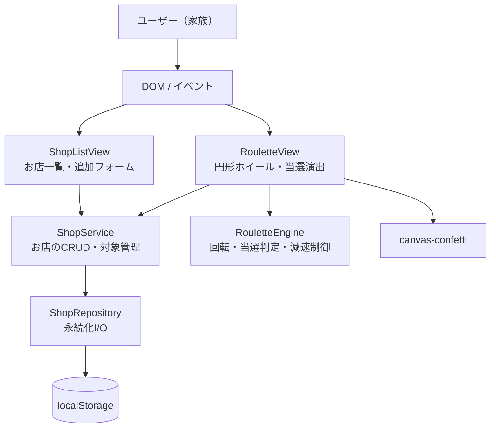
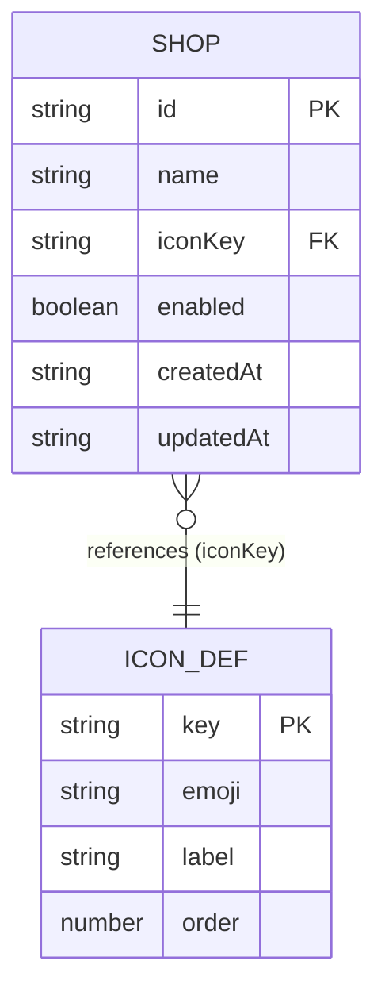
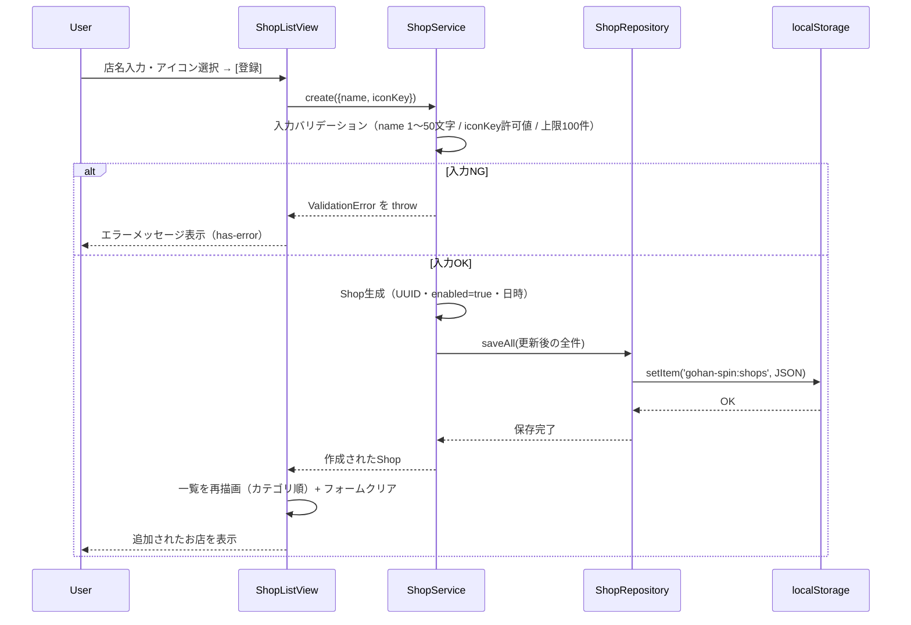
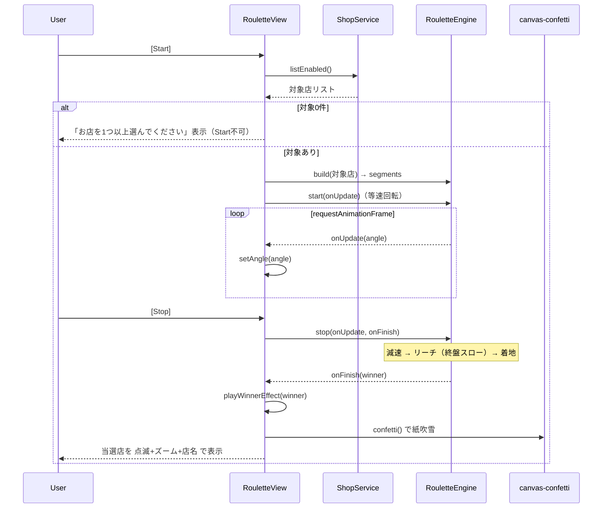
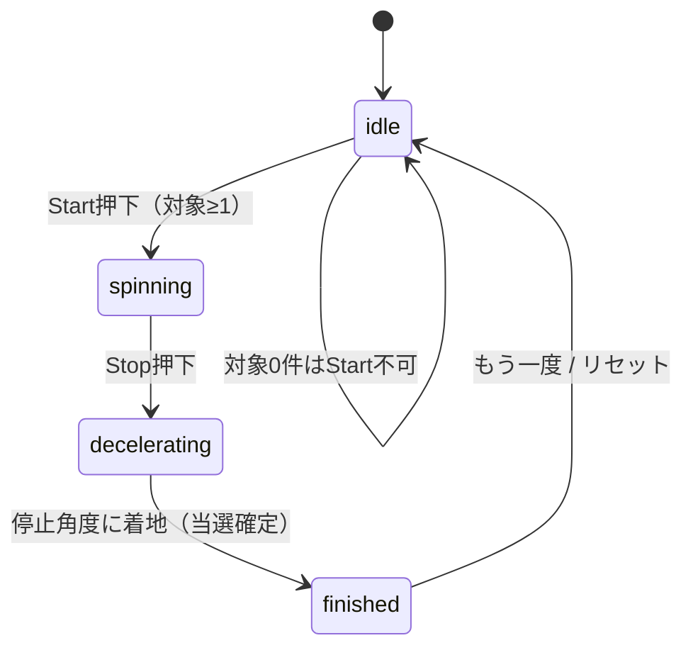

# 機能設計書 (Functional Design Document)

> 作成日: 2026-06-08
> 入力: `docs/product-requirements.md`
> 対象: PRDのP0(MVP)機能を技術的にどう実現するかを定義する。Post-MVP(外部リンク/SVG/効果音/他ブラウザ)は拡張ポイントとして言及する。

## システム構成図

サーバーを持たないブラウザ完結型SPA。UI・ビジネスロジック・永続化を3層に分離する。



**レイヤーの責務**:
- **View層** (`ShopListView` / `RouletteView`): DOM描画、ユーザー操作の受付、状態のCSSクラス制御、演出。ロジックは持たない。
- **Service層** (`ShopService`): お店のCRUD、対象(enabled)管理、カテゴリ順ソートなどのビジネスロジック。DOMにもlocalStorageにも直接依存しない。
- **Engine** (`RouletteEngine`): ルーレットの回転・減速・当選判定という独立ロジック。Viewから角度更新コールバックを受けて描画させる（純粋な計算に寄せる）。
- **Repository層** (`ShopRepository`): localStorageへの読み書き、JSONシリアライズ、破損時のフォールバック。

## 技術スタック

| 分類 | 技術 | 選定理由 |
|------|------|----------|
| 言語 | TypeScript ~6.0.3 | 型でデータモデル・状態を安全に表現。初心者でもエディタ補完で学びやすい |
| ビルド | Vite ^8.0.16 | 高速な開発サーバーとシンプルな静的ビルド。GitHub Pagesへの静的配信に適する |
| UI | 素のDOM + TypeScript（フレームワークなし） | 規模が小さく、学習目的。Reactなどの抽象を挟まず「何が起きているか」を理解しやすい |
| 描画 | DOM/CSS（円形ホイール） + canvas-confetti（紙吹雪） | ホイールはCSS transformの回転で実装可能。紙吹雪はMITライセンスの定番ライブラリ |
| 永続化 | localStorage | サーバーレス・アカウント不要の要件に合致。数十件のお店データに十分軽量 |
| テスト | Vitest + jsdom | Vite統合で高速。jsdomでDOM操作・Repositoryをテスト可能 |
| 品質 | ESLint + Prettier | 静的チェックと自動フォーマット（既に導入済み） |
| 配信 | GitHub Pages | サーバー不要の静的ホスティング |

> **canvas-confetti採用理由と代替案**: 採用理由は「MITライセンス・依存ゼロ・軽量・実績豊富」で、PRDのライセンス方針に合致するため（既に`package.json`へ導入済み）。代替案として(1)自前canvas実装＝学習価値は高いが工数とパフォーマンス調整コストが大きい、(2)tsParticles＝高機能だがMVPには過剰、を検討した上でcanvas-confettiを選定した。

## データモデル定義

### エンティティ: Shop（お店）

```typescript
interface Shop {
  id: string;          // UUID v4 (crypto.randomUUID())
  name: string;        // 店名。1〜50文字（必須・前後空白trim後）
  iconKey: IconKey;    // アイコンのキー文字列（絵文字へはマップ経由で解決）
  enabled: boolean;    // ルーレット対象フラグ。登録直後はtrue（デフォルトON）
  createdAt: string;   // 作成日時（ISO 8601文字列）
  updatedAt: string;   // 更新日時（ISO 8601文字列）
  // --- Post-MVP拡張予約（MVPでは未使用）---
  // url?: string;     // お店の外部リンク（P1で追加予定）
}

// アイコンはキー文字列で抽象化（将来、絵文字→SVGへ差し替え可能にするため）
type IconKey =
  | 'burger'
  | 'ramen'
  | 'pizza'
  | 'sushi'
  | 'curry'
  | 'cafe'
  | 'other';

// IconKey → 表示用絵文字 + カテゴリ表示名 + ソート順 の解決マップ（MVP実装）
interface IconDef {
  key: IconKey;
  emoji: string;       // 例: '🍔'
  label: string;       // 例: 'ハンバーガー'
  order: number;       // カテゴリ順ソートの並び順
}
```

**制約**:
- `name`: trim後1〜50文字。空文字・空白のみは不可。
- `iconKey`: `IconKey`のいずれか必須。UIでは初期値として `other` を選択済み状態にし、登録フォームで未選択状態を発生させない（＝実質的に未選択エラーは起きないが、防御的にバリデーションも行う）。
- `id`: `crypto.randomUUID()`で採番、不変。
- 日時はISO 8601の`string`で保持（localStorageはJSON文字列のため`Date`型より復元が安全）。
- カテゴリ／アイコンの**最終ラインナップは設計実装フェーズで確定**（PRD承認済み）。上記7種は暫定。

> **設計判断**: 「カテゴリ」を独立エンティティにせず`IconKey`に統合した。MVPでは1お店=1アイコン=1カテゴリで、カテゴリはアイコンの`order`/`label`から導出できるため、別テーブル化は過剰。これにより一覧の「カテゴリ順ソート」も`IconDef.order`で実現できる。

### ER図

MVPは単一エンティティ。`IconKey`は静的な定義マップへの参照（永続化されない静的データ）。



## コンポーネント設計

### ShopRepository（データレイヤー）

**責務**:
- localStorageへのお店データの読み書き（JSONシリアライズ／デシリアライズ）。
- スキーマ`version`管理と、破損データ・容量超過のフォールバック。

**インターフェース**:
```typescript
interface ShopStoreSchema {
  version: number;   // スキーマバージョン（現在: 1）
  shops: Shop[];
}

class ShopRepository {
  loadAll(): Shop[];          // 読み込み。破損/未存在時は[]で継続
  saveAll(shops: Shop[]): void; // 全件保存。失敗時はStorageErrorをthrow
  exists(): boolean;          // データが保存済みか（初回起動判定用。下記参照）
}
```

> **`exists()`の用途**: `loadAll()`は未存在時に`[]`を返すため通常の読み込みでは不要だが、「初回起動かどうか」を判定して**初回のみウェルカム/サンプルデータ表示**を出すなどのUX分岐に使う。この用途がMVPで不要と判断した場合は削除してよい。

**依存関係**: `localStorage`（キー: `gohan-spin:shops`）

### ShopService（サービスレイヤー）

**責務**:
- お店のCRUD、対象(enabled)切替、バリデーション、カテゴリ順ソート。
- 「ルーレット対象（enabled=true）のお店一覧」の取得。

**インターフェース**:
```typescript
interface CreateShopInput {
  name: string;
  iconKey: IconKey;
}
interface UpdateShopInput {
  name?: string;
  iconKey?: IconKey;
  enabled?: boolean;
}

class ShopService {
  constructor(private repo: ShopRepository);

  list(): Shop[];                              // 全件（カテゴリ順=IconDef.order, 同カテゴリ内はcreatedAt昇順）
  listEnabled(): Shop[];                       // 対象(enabled=true)のみ
  create(input: CreateShopInput): Shop;        // 採番・enabled=trueで作成・保存
  update(id: string, input: UpdateShopInput): Shop; // 部分更新・updatedAt更新
  toggleEnabled(id: string, enabled: boolean): Shop;
  remove(id: string): void;                    // 削除
}
```

**バリデーション方針**: `create` / `update` の両方で同じ検証を適用する。`update`では渡されたフィールドのみ検証する（`name`が渡された場合は`create`と同じく trim後1〜50文字、`iconKey`が渡された場合は許可値チェック）。対象`id`が存在しない場合は`ValidationError`（または`NotFoundError`）をthrowする。

**依存関係**: `ShopRepository`

### RouletteEngine（ルーレットの計算ロジック）

**責務**:
- 対象店リストを受け取り、ランダム順に並べ、各店のホイール上の角度区画を割り当てる。
- Start→等速回転、Stop→減速＋リーチ演出→停止角度を確定し、当選店を判定する。
- 角度の更新を`onUpdate`コールバックでViewへ通知（描画はViewの責務）。

**インターフェース**:
```typescript
interface WheelSegment {
  shop: Shop;
  startAngle: number;  // 区画の開始角度（度）
  endAngle: number;    // 区画の終了角度（度）
  color: string;       // 区画の塗り色（隣接で色が被らないよう割当。円環の先頭と末尾も隣接する点に注意）
}

type RouletteState = 'idle' | 'spinning' | 'decelerating' | 'finished';

type AngleListener = (angleDeg: number) => void;

class RouletteEngine {
  // 対象店からホイール区画を構築（ランダム配置）
  build(enabledShops: Shop[]): WheelSegment[];

  // 等速回転を開始（idle→spinning）。回転中は毎フレーム onUpdate(angle) を通知する
  start(onUpdate: AngleListener): void;
  // Stop押下: 現在角度から減速し、ランダムな停止角度へ着地（spinning→decelerating→finished）
  // onUpdate は start と同一のものを引き続き使う。着地時に onFinish(winner) を一度だけ呼ぶ
  stop(onUpdate: AngleListener, onFinish: (winner: Shop) => void): void;

  // 指針角度から当選セグメントを判定
  getWinner(finalAngleDeg: number): Shop;

  reset(): void;                                  // finished→idle
}
```

**依存関係**: なし（純粋ロジック）。`requestAnimationFrame`/`performance.now`を利用。回転状態（`state` / `currentAngle` / `rafId`）はEngine内部で保持し、`reset()`で`cancelAnimationFrame`してidleへ戻す。

### ShopListView / RouletteView（UIレイヤー）

**責務**:
- `ShopListView`: 追加フォーム描画、入力バリデーションのUI反映、一覧描画（カテゴリ順）、対象チェック・編集・削除の操作受付。
- `RouletteView`: ホイール描画（CSS transformで回転）、Start/Stopボタン制御、当選演出（点滅・ズーム・店名表示・紙吹雪）。

**インターフェース**:
```typescript
class ShopListView {
  render(shops: Shop[]): void;
  bindEvents(handlers: ShopListHandlers): void;  // onCreate/onEdit/onDelete/onToggle
  showValidationError(message: string): void;
}

class RouletteView {
  bindEvents(handlers: RouletteHandlers): void;  // onStart/onStop/onReset（mainがEngineを仲介）
  renderWheel(segments: WheelSegment[]): void;
  setAngle(angleDeg: number): void;              // ホイール回転をCSSへ反映
  setPhase(state: RouletteState): void;          // 状態に応じたStart/Stopボタン活性制御
  playWinnerEffect(winner: Shop): void;          // 点滅+ズーム+店名表示+confetti
  hideWinner(): void;                            // 「もう一度」で当選オーバーレイを閉じる
  setControlsEnabled(canStart: boolean): void;   // 対象0件時はStart不可
}
```

**依存関係**: `ShopService` / `RouletteEngine` / `canvas-confetti`

> **ホイール（扇形）の描画方式**: 円形ホイールの各区画（扇形）は純粋なCSSでは作りにくいため、MVPでは **`<canvas>`に扇形を描画**する方式を採用する（`renderWheel`で区画ごとに`arc`を塗り、店名/アイコンを配置）。回転は**canvas要素全体にCSS `transform: rotate()`** を当てて行い、回転のたびに再描画しない（GPU合成で軽量）。代替案として CSS `conic-gradient` での区画表現も可能だが、区画ごとのテキスト配置が難しいためcanvasを採る。この方式は初心者がつまずきやすい箇所のため、実装時はまず静止画の描画→次に回転、の順で進める。

## ユースケース図

### UC-1: お店の登録



> **バリデーションの配置（実装で確定）**: 入力検証は **View ではなく `ShopService.create()` 側に一元化**する。View は入力値をそのまま渡し、`ValidationError` を catch して日本語メッセージを表示する役割に徹する。これにより検証ロジックの重複を避け、UI 以外（テスト等）から `create()` を呼んでも同じ検証が必ず効く（単一責務・防御の単一地点）。

### UC-2: ルーレットを回して当選を決める



## 画面遷移図（ルーレットの状態遷移）



## アルゴリズム設計

### A-1. ホイール区画の割当（build）

**目的**: 対象店をホイール上にランダム順で等分配置し、各店に角度区画を割り当てる。

**ロジック**:
1. 対象店配列を**Fisher-Yatesシャッフル**でランダム並び替え（一覧のカテゴリ順とは独立させ、公平感・意外性を出す）。
2. 1店あたりの角度 = `360 / N`（N=対象店数）。
3. i番目の店の区画 = `startAngle = i * (360/N)`、`endAngle = (i+1) * (360/N)`。ただし**最後の区画の`endAngle`は厳密に`360`に固定**する（浮動小数点誤差で360未満になり、当選判定で隙間が生じるのを防ぐ）。
4. 色は**お店に対して安定的に割り当てる**（初登場時にパレット10色を循環割当し、Engine内の`Map<shopId, color>`で記憶）。位置基準の割当だとbuildのたびに色が変わり、「もう一度」でリセットした際に同じお店の色が変わって不自然になるため。隣接同色の回避（**ホイールは円環なので先頭と末尾も隣接する**点に注意）は、色を変えるのではなく**並びの再シャッフル（上限20回の試行）**で行う。パレット一周後（11店目以降）に同色のお店が生じても、再シャッフルでほぼ確実に隣接を回避できる（上限到達時のみ同色隣接を許容）。

```typescript
function shuffle<T>(arr: T[]): T[] {
  const a = [...arr];
  for (let i = a.length - 1; i > 0; i--) {
    const j = Math.floor(Math.random() * (i + 1));
    [a[i], a[j]] = [a[j], a[i]];
  }
  return a;
}
```

### A-2. 当選判定（getWinner）

**目的**: 停止時のホイール回転角度から、上部の針が指す店を逆算する。

**前提**: 針はホイール上部（12時方向＝画面上の0度位置）に固定。ホイールが時計回りに`angleDeg`回転した状態で、針の真下にある区画が当選。

**ロジック**:
```
- ホイールが angleDeg 回転 ⇒ 針はホイール座標系で逆向きに移動したのと等価。
- 針が指すホイール座標系の角度 pointer = ((360 - (angleDeg mod 360)) mod 360 + 360) mod 360
  （angleDeg が負でも 0〜360 未満に正規化できるよう二重に mod を取る）
- pointer が含まれる区画 [startAngle, endAngle) の店が当選。末尾区画は end を 360 とみなす。
```

```typescript
function getWinner(angleDeg: number, segments: WheelSegment[]): Shop {
  // angleDeg が負の場合でも 0〜360 未満へ正規化する（JSの % は負を返すため二重 mod）
  const pointer = (((360 - (angleDeg % 360)) % 360) + 360) % 360;
  const seg = segments.find((s, i) => {
    // 最後の区画は end を 360 として扱い、pointer=0 や浮動小数点誤差で穴が開くのを防ぐ
    const end = i === segments.length - 1 ? 360 : s.endAngle;
    return pointer >= s.startAngle && pointer < end;
  });
  return (seg ?? segments[0]).shop; // 念のためのフォールバック
}
```

> **設計上の重要点**: 「先に停止角度を乱数で決め、その角度から当選店を逆算」する方式を採る。これにより**当選は完全ランダム**で公平になり、アニメーションは見せ方に専念できる（＝演出と抽選ロジックを分離）。

### A-3. 等速回転（start）

**目的**: Startから（Stopが押されるまで）一定速度でホイールを回し続ける。

**設計**:
1. `state`を`spinning`にし、回転速度 `SPIN_SPEED_DEG_PER_MS`（`1.0`＝1000deg/s。実機の動作確認を経て360deg/sから段階的に引き上げ）を定数で持つ。
2. `requestAnimationFrame`で毎フレーム、前フレームからの経過時間ぶんだけ`currentAngle`を加算し`onUpdate`で通知。
3. `rafId`を保持し、`stop()`／`reset()`で停止できるようにする。

```typescript
const SPIN_SPEED_DEG_PER_MS = 1.0; // 1000deg/s（実機の動作確認を経て調整済み）

start(onUpdate: AngleListener): void {
  this.state = 'spinning';
  this.lastTime = performance.now();
  const tick = (now: number) => {
    if (this.state !== 'spinning') return;          // stop()でstateが変わったら抜ける
    const elapsed = now - this.lastTime;
    this.lastTime = now;
    this.currentAngle = (this.currentAngle + SPIN_SPEED_DEG_PER_MS * elapsed) % 360;
    onUpdate(this.currentAngle);
    this.rafId = requestAnimationFrame(tick);
  };
  this.rafId = requestAnimationFrame(tick);
}
```

### A-4. 減速 + リーチ演出（stop）

**目的**: Stop後に等速→減速し、終盤で「ぐっとスロー＆長く」して緊張感（リーチ）を最大化してから着地する。

**設計**:
1. `state`を`decelerating`にし、Stop時点の現在角度 `from`（=`currentAngle`）を取得。
2. 着地点 `landing` を乱数で決め、最終停止角度 `to = from + 最低5周 + landingまでのオフセット` とする（総距離 `distance` は1800〜2160度）。
3. 総減速時間 `durationMs` は固定レンジの乱数ではなく、**`durationMs = 5 × distance ÷ SPIN_SPEED_DEG_PER_MS`** で総距離から逆算する。`easeOutQuint` の初速は `5 × distance ÷ durationMs` のため、これで**減速の初速＝等速回転の速度**となり、Stop直後に一瞬加速して見える違和感がなくなる（速度の連続性）。距離が1800〜2160度のため所要時間は約9〜10.8秒（≒10秒）となり、ドキドキする時間を確保しつつ尺のばらつきも自然に生まれる。
4. イージングは**強めのease-out**を用い、終盤を長く伸ばす。`easeOutQuint = 1 - (1-t)^5`（cubicより終盤が粘る＝リーチ感）。
5. `requestAnimationFrame`で毎フレーム角度を補間し`onUpdate`。`t>=1`で`state='finished'`にし`onFinish(getWinner(to))`を一度だけ呼ぶ。

```typescript
function easeOutQuint(t: number): number {
  return 1 - Math.pow(1 - t, 5);
}

// 減速ループ（擬似コード）
stop(onUpdate: AngleListener, onFinish: (winner: Shop) => void): void {
  this.state = 'decelerating';
  const from = this.currentAngle;
  const landing = Math.random() * 360;                       // 着地点（完全ランダム）
  const offsetToLanding = (((landing - from) % 360) + 360) % 360;
  const distance = 5 * 360 + offsetToLanding;                // 最低5周＋着地点まで
  const to = from + distance;
  // easeOutQuint の初速(5×distance÷duration)が等速回転速度と一致するよう逆算
  const durationMs = (5 * distance) / SPIN_SPEED_DEG_PER_MS; // 約9000〜10800ms
  const startTime = performance.now();

  const tick = (now: number) => {
    const t = Math.min((now - startTime) / durationMs, 1);
    const eased = easeOutQuint(t);
    this.currentAngle = from + (to - from) * eased;
    onUpdate(this.currentAngle);
    if (t < 1) {
      this.rafId = requestAnimationFrame(tick);
    } else {
      this.state = 'finished';
      onFinish(this.getWinner(to));
    }
  };
  this.rafId = requestAnimationFrame(tick);
}
```

> **リーチの体感調整**: `easeOutQuint`で終盤が自然に粘る。さらに強調したい場合、最後の1区画ぶんに近づいたら一時的に追加スロー（duration後半の係数調整）を入れる余地を残す。具体的なカーブ係数は実装・実機確認で微調整する（PRDの未確定事項）。

## UI設計

### 画面レイアウト（レスポンシブ）

**デスクトップ（横並び）**:
```
┌───────────────────────────────────────────────┐
│  🎡 gohan-spin                                  │  ← ヘッダー
├──────────────────────┬────────────────────────┤
│  お店管理              │   ルーレット             │
│  [店名_____] [🍔▼]    │      ▼(針)              │
│  [＋登録]              │    ◜◝◜◝               │
│  ─────────            │   (  円形ホイール )      │
│ 🍔 ☑ バーガーA [✎][🗑]│    ◟◞◟◞               │
│ 🍜 ☑ ラーメンB [✎][🗑]│                        │
│ 🍜 ☐ ラーメンC [✎][🗑]│   [Start] [Stop]        │
└──────────────────────┴────────────────────────┘
```

**iPhone（縦積み・ルーレット主役）**:
```
┌─────────────────────┐
│  🎡 gohan-spin       │
├─────────────────────┤
│       ▼(針)          │
│     ◜◝◜◝            │
│   ( 円形ホイール )    │  ← 主役。横幅いっぱい
│     ◟◞◟◞            │
│   [Start] [Stop]     │  ← 指で押しやすい大きさ
├─────────────────────┤
│ ▸ お店を管理（開閉）   │  ← 折りたたみで省スペース
│ 🍔☑ バーガーA [✎][🗑]│
│ 🍜☑ ラーメンB [✎][🗑]│
└─────────────────────┘
```

**レイアウト切替方針**: CSS（メディアクエリ or `clamp()`/Flexbox/Grid）で、広幅は2カラム横並び、狭幅は1カラム縦積みへ。ホイールサイズは`min(画面幅, 高さ)`ベースで可変にし、針・ボタンが常に画面内に収まるようにする。タップターゲットは十分な大きさ（指で押しやすい間隔）を確保。

### コンポーネント一覧

| コンポーネント | 役割 | 主な状態(CSSクラス) |
|---------------|------|--------------------|
| AddShopForm | お店追加フォーム | `.has-error`（バリデーションNG） |
| ShopRow | 一覧の1行 | `.is-disabled`（対象OFF=グレーアウト） |
| Wheel | 円形ホイール | `.is-spinning` / `.is-decelerating` |
| WinnerOverlay | 当選表示 | `.is-blinking` / `.is-zoomed` |
| ControlButtons | Start/Stop | `.is-disabled`（対象0件でStart不可） |

### 状態の表現

- お店（対象ON）: 通常表示。
- お店（対象OFF）: グレーアウト（`.is-disabled`）。
- ホイール回転中: 等速アニメ（`.is-spinning`）、Stop後は減速（`.is-decelerating`）。
- 当選店: 点滅（`.is-blinking`）＋中央ズーム表示（`.is-zoomed`）＋アイコン＋店名併記＋紙吹雪。

### インタラクション（操作フロー）

1. 店名を入力しアイコンを選んで[登録] → 一覧へ追加（カテゴリ順）。
2. 一覧のチェックで対象ON/OFF、[✎]で編集、[🗑]で削除。
3. [Start]で回転開始 → [Stop]で減速・リーチ → 当選演出。
4. 当選演出後は「もう一度」ボタン、または当選オーバーレイの背景（カード外側）クリックでリセットし、再度回せる。

## ファイル構造（localStorageスキーマ）

```
localStorage のキー設計:
  gohan-spin:shops    # お店データ（ShopStoreSchemaのJSON文字列）
```

**`gohan-spin:shops` のJSON例**:
```json
{
  "version": 1,
  "shops": [
    {
      "id": "7a5c6ff0-5f55-474e-baf7-ea13624d73a4",
      "name": "〇〇バーガー 駅前店",
      "iconKey": "burger",
      "enabled": true,
      "createdAt": "2026-06-08T10:00:00.000Z",
      "updatedAt": "2026-06-08T10:00:00.000Z"
    }
  ]
}
```

**ポイント**:
- `version`でスキーマ変更（例: Post-MVPの`url`追加）に備える。読み込み時に`version`を見てマイグレーション可能。
- 値は文字列なので`JSON.stringify`/`JSON.parse`で出し入れ。
- 読み込み時は破損JSON・`null`に備え`try/catch`し、失敗時は空データで継続。

## パフォーマンス最適化

- **一覧の差分描画**: 数十件規模なので全再描画でも十分だが、`DocumentFragment`でまとめてDOM挿入しリフローを抑える。
- **ホイール回転**: CSS `transform: rotate()` をGPU合成で回し、`requestAnimationFrame`で角度更新。レイアウトを伴うプロパティ（top/left）は使わない。
- **当選判定**: 角度→区画はO(N)の線形探索で十分（N=数十）。
- **保存の節約**: 連続操作時は保存をまとめる余地を残す（MVPは操作都度保存で可）。

## セキュリティ考慮事項

- **外部送信なし**: お店データはlocalStorageのみ。ネットワーク送信しない。
- **XSS対策**: 店名はユーザー入力。DOMへは`textContent`で挿入し、`innerHTML`への生埋め込みを禁止（店名に`<script>`等が入っても無害化）。
- **機密情報なし**: APIキー・パスワード等を扱わない・ハードコードしない。
- **ライセンス**: 利用ライブラリはMIT互換に限定（canvas-confettiはMIT）。

## エラーハンドリング

| エラー種別 | 処理 | ユーザーへの表示 |
|-----------|------|-----------------|
| 入力検証エラー（店名空/長すぎ） | 登録中断、フォームに`.has-error` | "店名は1〜50文字で入力してください" |
| アイコン未選択 | 登録中断 | "アイコンを選択してください" |
| localStorage読み込み失敗（JSON破損/null） | 空データで継続、警告 | "保存データを読み込めませんでした。初期化します" |
| localStorage書き込み失敗（容量超過等） | 操作中断、リトライ促す | "保存に失敗しました。不要なお店を削除してください" |
| 対象0件でStart | Start不可（ボタンdisabled） | "ルーレット対象のお店を1つ以上選んでください" |
| 対象店が見つからない（削除との競合等） | 処理中断 | "お店が見つかりません" |

## テスト戦略

### ユニットテスト（Vitest）
> **カバレッジ目標**: ロジック層（Service/Engine/Repository）で `branches/functions/lines/statements` 各80%以上（`vitest.config.ts`で閾値設定済み・`architecture.md`と統一）。

- `ShopService`: create時のenabled=true初期化、バリデーション境界（0文字/50文字/51文字）、`update`のバリデーション（name渡し時のみ検証・存在しないidでエラー）、カテゴリ順ソート、toggleEnabled、remove。
- `RouletteEngine`: `getWinner`の角度→当選判定（区画境界・360度跨ぎ・`pointer=0`の末尾区画・負角度の正規化）、`build`のシャッフルが全件を欠落なく配置すること・最終区画のendAngleが360であること、N=1の特殊ケース。
- イージング関数: `easeOutQuint(0)=0`, `easeOutQuint(1)=1`, 単調増加。

### 統合テスト（Vitest + jsdom）
- `ShopService` + `ShopRepository`: 作成→保存→再読込でデータが一致（永続化ラウンドトリップ）。
- 破損JSONをlocalStorageに入れた状態で`loadAll()`が空配列を返し例外を投げないこと。

### E2Eテスト（手動 / 将来Playwright）
- お店登録→一覧表示→対象OFF→Start→Stop→当選演出までの一連フロー。
- iPhone Chrome実機（またはレスポンシブエミュレート）でホイール・ボタンが画面内に収まり操作できること。

## Post-MVP拡張ポイント（設計上の予約）

- **外部リンク(P1)**: `Shop.url?`を追加。`ShopStoreSchema.version`を上げてマイグレーション。一覧/当選表示にリンク導線。
- **SVGアイコン(P1)**: `IconKey`はそのまま、`IconDef`の解決先を絵文字→SVGコンポーネントへ差し替えるだけで対応可能（キー抽象化の効果）。
- **効果音(P1)**: Start操作起点で`AudioContext`を初期化（iOS/Chromeの自動再生制限を回避）。回転中カチカチ・停止時ドラムロール。
- **他ブラウザ(P2)**: CSS/JSのベンダー差異を検証。iOS WebKitはMVP時点で対象に含むため、ここでの主対象はデスクトップSafari/Firefox/Edge。
