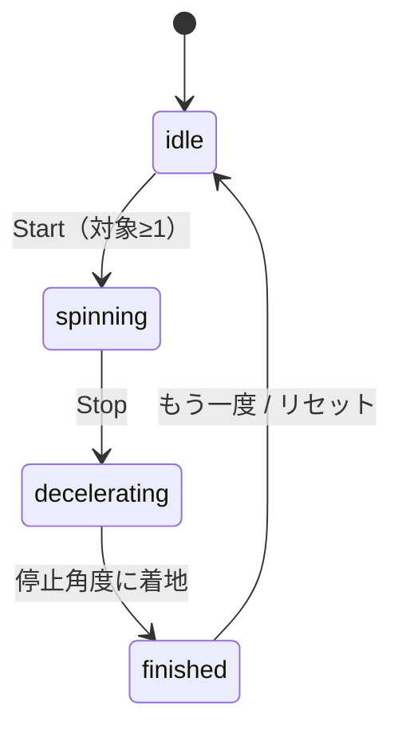

# プロジェクト用語集 (Glossary)

## 概要

このドキュメントは、gohan-spinプロジェクトで使用される用語の定義を管理します。PRD・機能設計書・アーキテクチャ設計書・リポジトリ構造・開発ガイドラインで使われる用語を、チーム共通言語（ユビキタス言語）として統一定義します。

**更新日**: 2026-06-08

---

## ドメイン用語

プロジェクト固有のビジネス概念・機能に関する用語。

### お店 (Shop)

**定義**: ルーレットの選択肢となる外食先。店名とアイコン、ルーレット対象フラグを持つ、本アプリの中心エンティティ。

**説明**: ユーザーがよく行く外食先を登録して管理する単位。数十件規模の登録を想定。データはlocalStorageに保存される。

**関連用語**: [対象（enabled）](#対象-enabled), [アイコンキー（IconKey）](#アイコンキー-iconkey), [ルーレット](#ルーレット-roulette)

**使用例**:
- 「お店を登録する」: 店名・アイコンを指定して新しいShopを作成する
- 「お店を編集・削除する」: 既存のShopを変更／除去する

**データモデル**: `src/types/Shop.ts`

**英語表記**: Shop

### 対象 (enabled)

**定義**: そのお店を今回のルーレットに含めるかどうかを示すフラグ（`enabled: boolean`）。チェックボックスで切り替える。

**説明**: 登録直後はデフォルトでON（`true`）。チェックを外すとルーレットの選択肢から除外される。一覧には全件表示されるが、ルーレットには対象ONの店だけが並ぶ。「探しやすさ（一覧）」と「その日の気分での絞り込み（対象）」を分ける概念。

**関連用語**: [お店（Shop）](#お店-shop), [ルーレット](#ルーレット-roulette)

**使用例**:
- 「このお店を対象から外す」: `enabled`を`false`にする
- 「対象が0件のときはStartできない」

**英語表記**: enabled / target

### ルーレット (Roulette)

**定義**: 対象ONのお店から1店をランダムに選ぶ、円形ホイール（運命の輪）型のコア機能。

**説明**: 上部の針が指したお店が当選となる。Startで回転開始、Stopで減速・停止。一覧（カテゴリ順）とは独立に、ホイール上ではランダム配置される。本アプリの北極星である「家族でドキドキする体験」の中心。

**関連用語**: [当選演出](#当選演出-winner-effect), [リーチ演出](#リーチ演出-reach), [当選判定](#当選判定-getwinner), [ルーレットの状態](#ルーレットの状態-roulettestate)

**使用例**:
- 「ルーレットを回す」: Start→Stopで1店を決める
- 「ルーレットに表示する」: 対象ONの店をホイールに配置する

**実装箇所**: `src/engine/RouletteEngine.ts`（計算） / `src/views/RouletteView.ts`（描画）

**英語表記**: Roulette / Wheel

### 当選演出 (Winner Effect)

**定義**: ルーレットで決まったお店を盛り上げて見せる一連の演出（点滅＋ズーム＋店名表示＋紙吹雪）。

**説明**: 当選店を点滅させ、アイコンと**店名をセット**で画面中央に大きく表示する。同じアイコンの店が複数あってもアイコンだけでは特定できないため、必ず店名を併記して一意に伝える。紙吹雪はcanvas-confettiで表示。これが他の単純ルーレットとの差別化ポイント。

**関連用語**: [リーチ演出](#リーチ演出-reach), [canvas-confetti](#canvas-confetti), [ルーレット](#ルーレット-roulette)

**使用例**:
- 「当選演出を再生する」: `RouletteView.playWinnerEffect(winner)`

**英語表記**: Winner Effect

### リーチ演出 (Reach)

**定義**: 減速の最終局面で回転をぐっとスロー＆長くして、当選直前の緊張感を最大化する演出。

**説明**: 「どっち〜！？」という"あと一歩"の緊張感を狙う。技術的には強めのイージング（`easeOutQuint`）で終盤を粘らせることで実現する。減速カーブの具体係数は実機確認で微調整する（未確定事項）。

**関連用語**: [イージング](#イージング-easing), [当選演出](#当選演出-winner-effect)

**英語表記**: Reach

### アイコンキー (IconKey)

**定義**: お店のアイコンを表す内部のキー文字列（例: `'burger'`, `'ramen'`）。表示用の絵文字やカテゴリ名とは分離されている。

**説明**: MVPでは`IconKey`を絵文字（🍔など）にマップして表示するが、キーで抽象化することで、将来は絵文字→SVGアイコンセットへ**解決先を差し替えるだけ**で移行できる。カテゴリ順ソートも`IconKey`に紐づく`order`で実現する。

**関連用語**: [カテゴリ](#カテゴリ-category), [お店（Shop）](#お店-shop)

**使用例**:
```typescript
type IconKey = 'burger' | 'ramen' | 'pizza' | 'sushi' | 'curry' | 'cafe' | 'other';
```

**データモデル**: `src/types/IconKey.ts` / 解決マップ: `src/icons/iconDefs.ts`

**英語表記**: IconKey

### カテゴリ (Category)

**定義**: お店の種類（ハンバーガー／ラーメン等）。MVPでは`IconKey`と1対1に対応し、一覧のソート順を決める。

**説明**: 独立したエンティティではなく、`IconKey`に紐づく表示ラベルとソート順（`IconDef.order`）として表現する。一覧は「探しやすさ」のためカテゴリ順で表示される。最終ラインナップは設計実装フェーズで確定する。

**関連用語**: [アイコンキー（IconKey）](#アイコンキー-iconkey)

**英語表記**: Category

### ステアリングファイル (Steering File)

**定義**: 特定の開発作業における「今回何をするか」を定義する作業単位の一時ドキュメント。

**説明**: `.steering/[YYYYMMDD]-[task-name]/` に `requirements.md` / `design.md` / `tasklist.md` を配置する。永続ドキュメント（`docs/`）とは異なり、作業ごとに新規作成される。gitignore対象。

**関連用語**: [永続ドキュメント](#永続ドキュメント-persistent-document)

**英語表記**: Steering File

### 永続ドキュメント (Persistent Document)

**定義**: アプリ全体の「何を作るか／どう作るか」を定義する、長期保存される`docs/`配下のドキュメント群。

**説明**: PRD・機能設計書・アーキテクチャ設計書・リポジトリ構造・開発ガイドライン・用語集の6つ。プロジェクトの「北極星」として機能し、頻繁には更新されない。

**関連用語**: [ステアリングファイル](#ステアリングファイル-steering-file)

**英語表記**: Persistent Document

---

## 技術用語

### TypeScript

**定義**: JavaScriptに静的型付けを追加したプログラミング言語。

**公式サイト**: https://www.typescriptlang.org/

**本プロジェクトでの用途**: 全ソースコードを記述。`strict`モード＋追加の厳格オプションで型安全を確保。

**バージョン**: ~6.0.3

**選定理由**: 型によるバグの早期検出、エディタ補完、初心者の学習効率。

**設定ファイル**: `tsconfig.json`

### Vite

**定義**: 高速な開発サーバーとビルドを提供するフロントエンドビルドツール。

**公式サイト**: https://vite.dev/

**本プロジェクトでの用途**: 開発時はHMR付きdevサーバー、本番は静的アセット（HTML/CSS/JS）を`dist/`へ出力しGitHub Pagesへ配信。

**バージョン**: ^8.0.16

**設定ファイル**: `vite.config.ts`

### localStorage

**定義**: ブラウザがオリジン単位でデータを永続保存する、Web標準のキー・バリュー型ストレージ（同期API）。

**本プロジェクトでの用途**: お店データを`gohan-spin:shops`キーにJSON文字列で保存。サーバーレス・アカウント不要を実現する中核。

**制約**: 1オリジン概ね5MB上限、文字列のみ保存、同期APIのため巨大データはメインスレッドをブロックしうる。

**関連用語**: [ShopRepository](#shoprepository), [スキーマバージョニング](#スキーマバージョニング-schema-versioning)

### canvas-confetti

**定義**: canvasで紙吹雪アニメーションを描画する軽量なMITライセンスのライブラリ。

**公式サイト**: https://github.com/catdad/canvas-confetti

**本プロジェクトでの用途**: 当選演出の紙吹雪。

**バージョン**: ^1.9.4

**選定理由**: MITライセンス・依存ゼロ・軽量・実績豊富。代替案（自前canvas実装、tsParticles）と比較しMVPに最適。

### Vitest

**定義**: Viteベースの高速なテストフレームワーク。

**公式サイト**: https://vitest.dev/

**本プロジェクトでの用途**: ユニット／統合テスト。jsdom環境でDOM・Repositoryを検証。カバレッジ閾値80%を強制。

**バージョン**: ^4.1.8

**設定ファイル**: `vitest.config.ts`

### ESLint / Prettier

**定義**: ESLintは静的解析ツール、Prettierはコード整形ツール。

**本プロジェクトでの用途**: ESLintで`any`禁止・未使用変数禁止等を強制、Prettierで整形を自動化。huskyのpre-commitで自動実行。

**バージョン**: ESLint ^10.4.1 / Prettier ^3.8.3

**設定ファイル**: `eslint.config.js` / `.prettierrc`

---

## 略語・頭字語

### SPA

**正式名称**: Single Page Application

**意味**: 単一HTMLページをDOM操作で動的に書き換えて画面を切り替えるWeb UIの方式。

**本プロジェクトでの使用**: メインUI方式。ページ全体を再読み込みせず、お店管理とルーレットを1画面で切り替える。

**実装**: `src/views/`

### PRD

**正式名称**: Product Requirements Document（プロダクト要求定義書）

**意味**: 「何を・なぜ作るか」を定義するドキュメント。

**本プロジェクトでの使用**: `docs/product-requirements.md`。全設計の起点。

### MVP

**正式名称**: Minimum Viable Product（実用最小限の製品）

**意味**: プロダクトとして成立する最小限の機能セット。

**本プロジェクトでの使用**: お店登録・一覧管理・ルーレット・当選演出のP0機能を指す。外部リンク／SVG／効果音はPost-MVP。

### FCP

**正式名称**: First Contentful Paint

**意味**: 最初のコンテンツが描画されるまでの時間。表示速度の指標。

**本プロジェクトでの使用**: 非機能要件の目標値「1.5秒以内」の測定指標。

### XSS

**正式名称**: Cross-Site Scripting

**意味**: 悪意あるスクリプトをWebページに注入させる脆弱性。

**本プロジェクトでの使用**: 店名（ユーザー入力）を`textContent`で反映し`innerHTML`を避けることで対策。

---

## アーキテクチャ用語

### レイヤードアーキテクチャ (Layered Architecture)

**定義**: システムを役割ごとの層に分割し、上位層から下位層への一方向依存に保つ設計パターン。

**本プロジェクトでの適用**:
```
UIレイヤー (views/)
    ↓
サービス/エンジンレイヤー (services/ , engine/)
    ↓
データレイヤー (repositories/) → localStorage
```

**各層の責務**:
- UI: DOM描画・操作受付・演出
- Service/Engine: お店CRUD（Service）／ルーレット計算（Engine）
- Data: localStorageの永続化

**メリット**: 関心の分離による保守性・テスト容易性。localStorage→将来のクラウド保存へ差し替えてもRepositoryだけ直せばよい。

**デメリット**: 小規模では過剰になりうる（本プロジェクトは学習目的も兼ねて採用）。

**依存ルール**:
- ✅ UI → Service/Engine → Data
- ❌ Data → Service/UI、❌ View → localStorage直接アクセス

**参考**: [architecture.md](./architecture.md) / [repository-structure.md](./repository-structure.md)

### スキーマバージョニング (Schema Versioning)

**定義**: 保存データに`version`番号を持たせ、スキーマ変更時に旧→新へ変換（マイグレーション）できるようにする手法。

**本プロジェクトでの適用**: `ShopStoreSchema`に`version: 1`を保持。Post-MVPで`Shop.url`等を追加する際、読み込み時に`version`を見て変換する。

**実装箇所**: `src/repositories/ShopRepository.ts`

---

## ステータス・状態

### ルーレットの状態 (RouletteState)

**定義**: ルーレットの進行状態を示す列挙型。

**取りうる値**:

| 状態 | 意味 | 遷移条件 | 次の状態 |
|------|------|---------|---------|
| `idle` | 停止中（待機） | 初期状態 / リセット後 | `spinning` |
| `spinning` | 等速回転中 | Start押下（対象≥1） | `decelerating` |
| `decelerating` | 減速中（リーチ含む） | Stop押下 | `finished` |
| `finished` | 当選確定・演出中 | 停止角度に着地 | `idle` |

**状態遷移図**:


**実装**:
```typescript
// src/engine/RouletteEngine.ts
type RouletteState = 'idle' | 'spinning' | 'decelerating' | 'finished';
```

**ビジネスルール**: 対象0件のとき`idle`からStartできない。

---

## データモデル用語

### Shop（エンティティ）

**定義**: お店を表す唯一の永続エンティティ。

**主要フィールド**:
- `id`: UUID v4（`crypto.randomUUID()`で採番、不変）
- `name`: 店名（trim後1〜50文字）
- `iconKey`: アイコンキー（`IconKey`）
- `enabled`: ルーレット対象フラグ（初期値`true`）
- `createdAt` / `updatedAt`: ISO 8601文字列の日時

**制約**: `name`は必須・1〜50文字、`iconKey`は許可値のみ。

**関連用語**: [アイコンキー（IconKey）](#アイコンキー-iconkey), [対象（enabled）](#対象-enabled)

### ShopRepository

**定義**: localStorageへのお店データの読み書きを担うデータレイヤーのコンポーネント。

**主要メソッド**: `loadAll()` / `saveAll()` / `exists()`

**特性**: 破損JSON・未存在時は空配列で継続（フォールバック）。書き込み失敗時は`StorageError`。

**実装箇所**: `src/repositories/ShopRepository.ts`

---

## エラー・例外

### バリデーションエラー (ValidationError)

**クラス名**: `ValidationError`

**継承元**: `Error`

**発生条件**: ユーザー入力が制約に違反した場合（店名が空／50文字超、アイコン未選択）。

**対処方法**:
- ユーザー: メッセージに従って入力を修正
- 開発者: バリデーションロジックを確認

**ログレベル**: WARN（ユーザー起因）

**使用例**:
```typescript
if (name.trim().length === 0) {
  throw new ValidationError('店名は1〜50文字で入力してください', 'name', name);
}
```

### ストレージエラー (StorageError)

**クラス名**: `StorageError`

**継承元**: `Error`

**発生条件**: localStorageへの書き込み失敗（容量超過等）。

**対処方法**:
- ユーザー: 不要なお店を削除して再試行
- 開発者: 容量・例外内容を確認

**ログレベル**: ERROR

**補足**: 読み込み失敗は例外を投げず空データで継続する（クラッシュさせない方針）。

---

## 計算・アルゴリズム

### 当選判定 (getWinner)

**定義**: ルーレット停止時の回転角度から、上部の針が指すお店を逆算する計算。

**計算式**:
```
pointer = ((360 - (angleDeg mod 360)) mod 360 + 360) mod 360
→ pointer が含まれる区画 [startAngle, endAngle) の店が当選（末尾区画は end を 360 とみなす）
```

**説明**: ホイールがangleDeg回転すると、針はホイール座標系で逆向きに移動したのと等価になるため、360から引いて針の指す角度を求める。`angleDeg`が負でも0〜360未満に収まるよう二重にmodを取る。浮動小数点誤差や`pointer=0`で穴が開かないよう、末尾区画は終端を360として扱う（詳細は機能設計書 A-2）。

**実装箇所**: `src/engine/RouletteEngine.ts`

**設計方針**: 停止角度を先に乱数で決め、そこから当選店を逆算する。これにより抽選（完全ランダム）と演出（見せ方）を分離する。

### イージング (Easing)

**定義**: アニメーションの進行度（0→1）に対する変化の緩急を定義する関数。

**本プロジェクトでの用途**: ルーレットの減速。終盤を粘らせてリーチ感を出すため`easeOutQuint`を採用。

**計算式**:
```
easeOutQuint(t) = 1 - (1 - t)^5   （t: 0〜1の進行度）
```

**説明**: 指数が大きいほど終盤がゆっくりになる。ガイドの`easeOutCubic`（3乗）より粘りが強く、緊張感を高められる。

**実装箇所**: `src/engine/easing.ts`

**性質**: `f(0)=0`, `f(1)=1`, 単調増加（テストで検証）。

### Fisher-Yatesシャッフル (Fisher-Yates Shuffle)

**定義**: 配列をO(N)で偏りなくランダム並び替えするアルゴリズム。

**本プロジェクトでの用途**: ルーレットのホイール区画割当で、対象店を一覧（カテゴリ順）とは独立にランダム配置する。

**実装箇所**: `src/engine/RouletteEngine.ts`（`build`内）

---

## 索引

### あ行
- [アイコンキー（IconKey）](#アイコンキー-iconkey) - ドメイン用語
- [イージング](#イージング-easing) - アルゴリズム
- [永続ドキュメント](#永続ドキュメント-persistent-document) - ドメイン用語
- [お店（Shop）](#お店-shop) - ドメイン用語

### か行
- [カテゴリ](#カテゴリ-category) - ドメイン用語

### さ行
- [スキーマバージョニング](#スキーマバージョニング-schema-versioning) - アーキテクチャ用語
- [ステアリングファイル](#ステアリングファイル-steering-file) - ドメイン用語
- [ストレージエラー](#ストレージエラー-storageerror) - エラー

### た行
- [対象（enabled）](#対象-enabled) - ドメイン用語
- [当選演出](#当選演出-winner-effect) - ドメイン用語
- [当選判定（getWinner）](#当選判定-getwinner) - アルゴリズム

### は行
- [バリデーションエラー](#バリデーションエラー-validationerror) - エラー
- [Fisher-Yatesシャッフル](#fisher-yatesシャッフル-fisher-yates-shuffle) - アルゴリズム

### ら行
- [リーチ演出](#リーチ演出-reach) - ドメイン用語
- [ルーレット](#ルーレット-roulette) - ドメイン用語
- [ルーレットの状態](#ルーレットの状態-roulettestate) - ステータス
- [レイヤードアーキテクチャ](#レイヤードアーキテクチャ-layered-architecture) - アーキテクチャ用語

### A-Z
- [canvas-confetti](#canvas-confetti) - 技術用語
- [ESLint / Prettier](#eslint--prettier) - 技術用語
- [FCP](#fcp) - 略語
- [localStorage](#localstorage) - 技術用語
- [MVP](#mvp) - 略語
- [PRD](#prd) - 略語
- [Shop](#shopエンティティ) - データモデル
- [ShopRepository](#shoprepository) - データモデル
- [SPA](#spa) - 略語
- [TypeScript](#typescript) - 技術用語
- [Vite](#vite) - 技術用語
- [Vitest](#vitest) - 技術用語
- [XSS](#xss) - 略語

---

## 変更履歴

| 日付 | 変更内容 |
|------|----------|
| 2026-06-08 | 初版作成（6つの永続ドキュメントから用語を抽出） |
